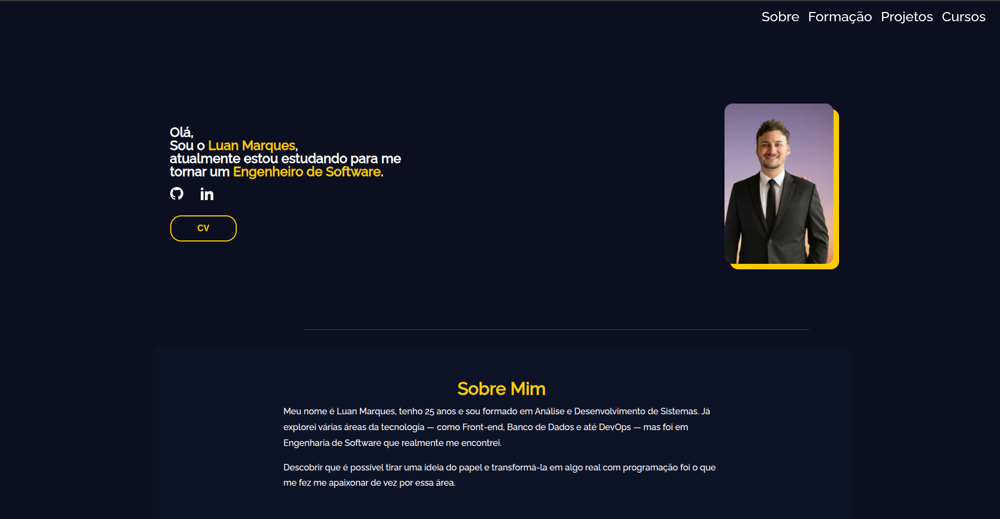

# 🧑‍💻 Luan UI – Portfólio Pessoal



> Um portfólio desenvolvido para apresentar minha trajetória, habilidades e projetos como futuro Engenheiro de Software.

---

## 🚀 Tecnologias

- HTML5
- CSS3
- JavaScript

---

## 🎨 Layout

O projeto é **responsivo** e possui uma divisão clara de seções:

- Hero (introdução com foto e links)
- Sobre Mim
- Formação
- Projetos
- Botão para baixar meu [Currículo](./assets/cv/Luan-Marques.pdf)

---

## 📁 Estrutura do Projeto

```bash
luan-ui
├── assets/
│   ├── cv/
│   ├── icons/
│   └── img/
├── scripts/
│   └── nav.js
├── styles/
│   ├── about.css
│   ├── ...
├── index.html
